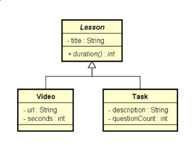

# Desafio: Plataforma de ensino

Você foi contratada(o) para criar um sistema de plataforma de ensino. Para isto você deve criar um
programa para ler os dados das aulas de um curso, e em seguida mostrar a duração total do curso, que é
a soma das durações de cada aula.

Cada aula pode ser um conteúdo em vídeo, ou então uma tarefa. Os dados de cada aula são:
Vídeo: título, url e duração em segundos
Tarefa: título, descrição e quantidade de questões

A duração (em segundos) de uma aula vídeo é a própria duração do vídeo, e a duração de uma aula tarefa é de cinco minutos por questão (exemplo: 
se a tarefa possui 3 questões, então a duração da tarefa é 15 minutos).

Você deve representar os dados conforme modelo ao lado. O método duration() na classe Lesson é um Você deve criar uma única lista do tipo
List<Lesson> para armazenar todas aulas. A chamada do método duration() deve ser polimórfica.método abstrato que retorna a duração da aula.



```
Quantas aulas tem o curso? 3

Dados da 1a aula:
Conteúdo ou tarefa (c/t)? c
Título: Orientação a objetos
URL do vídeo: https://youtu.be/aBh
Duração em segundos: 310

Dados da 2a aula:
Conteúdo ou tarefa (c/t)? c
Título: Listas em Java
URL do vídeo: https://youtu.be/e5a
Duração em segundos: 250

Dados da 3a aula:
Conteúdo ou tarefa (c/t)? t
Título: Exercício de fixação
Descrição: Faça um programa que imprima uma lista
Quantidade de questões: 2

DURAÇÃO TOTAL DO CURSO = 1160 segundos
